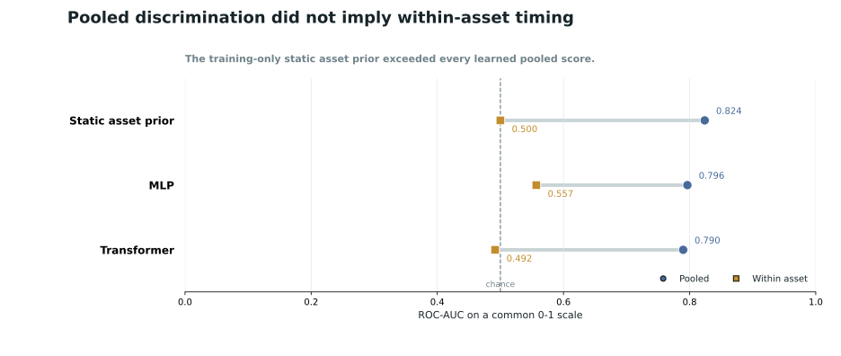
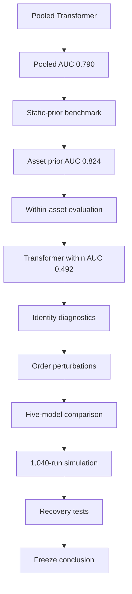
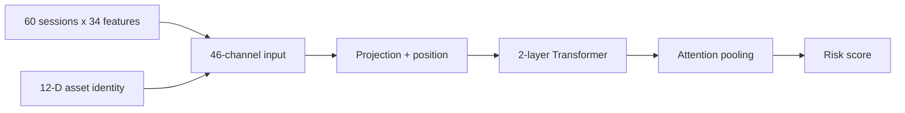
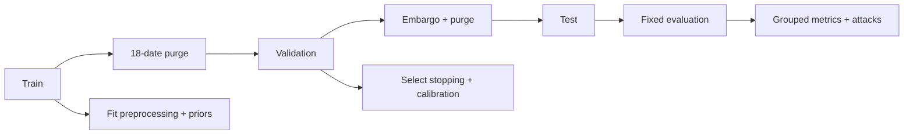
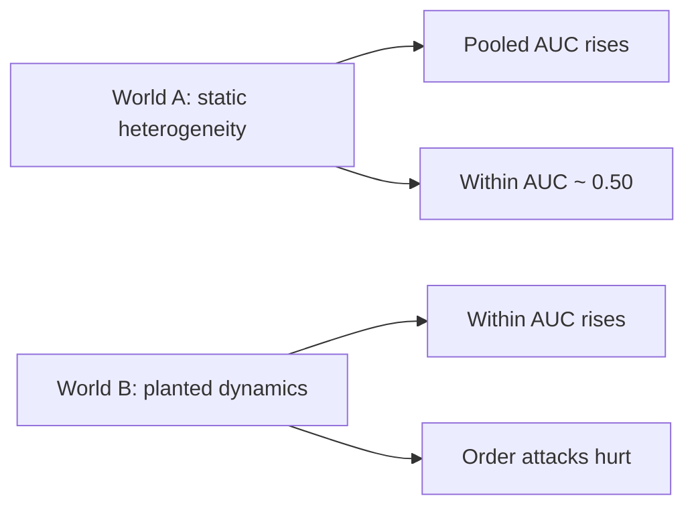

# Interpretable Transformer Models for Financial Time Series Forecasting

**Discovering Emergent Market Dynamics**

[](https://www.python.org/)
[](https://pytorch.org/)
[](#project-status)
[](https://github.com/husaam-atq/MSc-financial-transformer-market-dynamics/actions/workflows/ci.yml)

A leakage-aware, multi-asset financial forecasting study that asks whether strong
pooled Transformer performance reflects changing market conditions or persistent
differences between assets.

> [!IMPORTANT]
> **Central finding:** the corrected Transformer achieved pooled ROC-AUC
> **0.789814**, but a training-only static asset prior achieved **0.823906** and
> the Transformer's pair-weighted within-asset ROC-AUC was **0.491638**.
> Strong pooled ranking did not establish robust within-asset timing. The pooled
> AUC should not be interpreted as evidence of within-asset timing skill.

This is a supervised forecasting and model-evaluation project. It is not a trading
system, portfolio strategy, or deployment claim.

**Choose your path:** [Examiner: results and methodology](#results-at-a-glance) |
[Researcher: evidence and simulation](#falsification-suite) |
[Developer: setup and tests](#quick-start) |
[Dissertation: eight-page PDF](reports/paper/draft_dissertation_paper_v4.pdf)

**Key links:** [Read the dissertation PDF](reports/paper/draft_dissertation_paper_v4.pdf) |
[View its Markdown source](reports/paper/draft_dissertation_paper_v4.md) |
[Reproduce the evidence](#reproduction) | [Start locally](#quick-start) |
[See headline results](#results-at-a-glance) |
[Browse the frozen release tag](https://github.com/husaam-atq/MSc-financial-transformer-market-dynamics/tree/dissertation-final)

## Contents

- [Core question](#core-question)
- [Results at a glance](#results-at-a-glance)
- [Research takeaways](#research-takeaways)
- [Research decision path](#research-decision-path)
- [Data and task](#data-and-task)
- [Features and model](#features-and-model)
- [Leakage-aware evaluation](#leakage-aware-evaluation)
- [Falsification suite](#falsification-suite)
- [Cross-model results](#cross-model-results)
- [Controlled simulation](#controlled-simulation)
- [Recovery tests](#recovery-tests)
- [Interpretation](#interpretation)
- [Repository guide](#repository-guide)
- [Quick start](#quick-start)
- [Reproduction](#reproduction)
- [Dissertation](#dissertation)
- [Limitations](#limitations)
- [Project status](#project-status)

## Core question

Can a pooled multi-asset Transformer identify changing risk through time, or can
high pooled discrimination arise because some assets are persistently more likely
to experience the target than others?

A pooled metric compares every positive row with every negative row. If one asset
has a high event rate and another has a low event rate, a score that is constant
within each asset can rank many cross-asset pairs correctly. That score has useful
cross-sectional information, but it has no timing ability within either asset.

<details>
<summary><strong>Why can a static asset prior have high pooled AUC?</strong></summary>

Suppose asset A experiences the event on 40% of dates and asset B on 5%. Assigning
0.40 to every row of A and 0.05 to every row of B correctly orders many positive A
rows above negative B rows. The pooled AUC can therefore be high even though the
score never changes through time.

This project fits each asset prior from training labels only. It then reports both:

- pooled AUC, which includes within-asset and between-asset pairs; and
- pair-weighted within-asset AUC, which excludes all between-asset pairs.

The difference reveals whether aggregate ranking is mainly cross-sectional or
whether the model also ranks changing states within an asset.

</details>

## Results at a glance

| Evidence | Pooled ROC-AUC | Within-asset ROC-AUC | Interpretation |
|---|---:|---:|---|
| Static asset prior, training only | **0.823906** | 0.500000 | Cross-sectional prevalence only |
| Static family prior, training only | 0.816549 | 0.500000 | Family-level prevalence only |
| MLP ensemble | 0.796478 | **0.556967** | Modest conditional association; chronology gate failed |
| Transformer ensemble | 0.789814 | 0.491638 | Strong pooled ranking; no useful within-asset ranking |
| Transformer without explicit asset ID | 0.715477 | 0.472570 | Identity materially affected pooled ranking |

The MLP's within-asset interval was **[0.504831, 0.600824]**, but its registered
chronology conditions failed. Across flattened logistic regression, MLP, LSTM,
TCN and Transformer models, **0 of 5** passed the strict ordered-temporal-skill
gate.

Ranking metrics use raw ensemble scores. Brier score, log loss and thresholded
metrics use validation-selected calibrated probabilities. These score types are
not mixed.



*Pooled discrimination versus within-asset discrimination. All values use the
same 0-1 AUC scale; the MLP did not pass the ordered-temporal-skill gate.*

## Research takeaways

1. A pooled AUC near 0.79 initially looked strong, but the static asset prior
   reached 0.824 without any time-varying score.
2. Conditioning evaluation within asset changed the interpretation: the
   Transformer fell to approximately chance while the MLP retained modest
   conditional association.
3. Controlled simulation showed that the diagnostics distinguish static
   heterogeneity from deliberately planted ordered temporal signal.

## Research decision path

The project began as a forecasting study and became an investigation of what the
forecasting metric was actually measuring.



Each step was introduced to test a specific alternative explanation. The later
diagnostics do not retroactively turn the opened historical test period into
independent confirmation.

## Data and task

### Panel

| Property | Final corrected design |
|---|---|
| Configured instruments | 80 |
| Instruments with valid final windows | 79 |
| Asset families | Equities, bonds, commodities, FX, crypto, real-asset proxies |
| Observed daily OHLCV rows | 306,174 |
| Available period | 2010-01-04 to 2026-06-23, where available |
| Final test origins | 21,514 |
| Market-data source | Yahoo Finance |
| Context source | FRED |
| Raw data in Git | No |

The pipeline uses observed sessions within each asset. It does not forward-fill ETF
weekends into the seven-day crypto calendar. Adjusted close is preferred for returns
and targets; raw OHLC fields are retained for range, gap and intraday-style features.

> [!NOTE]
> Raw market and provider data are not redistributed in this repository. Users
> must obtain them under the providers' current terms and should expect public
> APIs, revisions and symbol histories to change.

### Forecast origin and target

At close `t`, the model receives the preceding 60 observed sessions, including
session `t`. The binary target uses only the next ten observed sessions:

$$
\begin{aligned}
R_{10}(t) &= \frac{P_{t+10}}{P_t} - 1, \\
D_{10}(t) &= \min_{1 \leq k \leq 10}\left(\frac{P_{t+k}}{P_t} - 1\right), \\
RV_{10}(t) &= \sqrt{\sum_{k=1}^{10} r_{t+k}^{2}}.
\end{aligned}
$$

Here, $P_t$ is adjusted close where available, $r_t$ is the one-session log
return, and $\widehat{\sigma}_{20}(t)$ is trailing 20-session volatility.

The positive-target rule is:

$$
Y_t = \mathbf{1}\!\left[
R_{10}(t) \leq -0.05
\;\lor\;
D_{10}(t) \leq -0.07
\;\lor\;
RV_{10}(t) \geq 2\,\widehat{\sigma}_{20}(t)\sqrt{10}
\right].
$$

In plain English, the target is positive if **any** condition holds:

- terminal return `R10(t) <= -5%`;
- minimum path return `D10(t) <= -7%`; or
- future realised volatility is at least twice trailing 20-session volatility,
  scaled to ten sessions.

Incomplete future horizons are removed. Neighbouring labels overlap, so split gaps
and dependence-aware uncertainty are essential.

## Features and model

### Direct inputs

| Group | Channels | Examples |
|---|---:|---|
| Price and return | 6 | close return, log return, open-close return, range, overnight gap |
| Volatility | 6 | 5/10/20-session volatility, downside volatility, EWMA volatility |
| Momentum and trend | 6 | cumulative returns, moving-average distance/crossover, RSI, MACD |
| Volume and activity | 4 | volume change, z-score, moving-average ratio, price-volume interaction |
| Stress and drawdown | 5 | rolling drawdown, distance from highs, negative streak, downside indicator |
| Macro and context | 7 | DFF, DGS2, DGS10, T10Y2Y, VIXCLS, BAMLH0A0HYM2, DTWEXBGS |
| **Numerical total** | **34** | Train-scaled per asset |
| Learned asset embedding | 12 | Repeated across the 60 timesteps |
| **Conditioned input total** | **46** | After concatenation |

The seven context series are lagged by at least one business day before backward
alignment. They remain provenance-limited because the final historical panel is not
a complete real-time vintage reconstruction.

<details>
<summary><strong>Transformer configuration</strong></summary>

| Setting | Value |
|---|---:|
| Lookback | 60 observed sessions |
| Numerical channels | 34 |
| Asset embedding | 12 |
| Model width | 128 |
| Encoder layers | 2 pre-normalised layers |
| Attention heads | 4 |
| Feed-forward width | 256 |
| Activation | GELU |
| Dropout | 0.3 |
| Position encoding | Sinusoidal, maximum length 1,024 |
| Pooling | Temporal attention |
| Head | LayerNorm and linear logit |
| Parameters | 272,449 |
| Loss | Soft-F1 |
| Optimiser | AdamW |
| Learning rate | 3e-4 |
| Weight decay | 1e-4 |
| Batch size | 1,024 |
| Maximum epochs | 12 |
| Early-stopping patience | 3 |
| Seeds | 7, 42, 123 |

No family label or explicit missingness indicator enters the final Transformer.

</details>



## Leakage-aware evaluation

| Split | Date range | Windows |
|---|---|---:|
| Train | 2010-01-04 to 2023-11-24 | 245,055 |
| Validation | 2023-12-14 to 2025-02-23 | 20,494 |
| Test | 2025-03-15 to 2026-06-13 | 21,514 |

The corrected fold uses a purge of 18 global dates and an embargo of one date.
A direct interval audit found zero label intervals crossing the final boundaries.

- Windows never cross assets or split boundaries.
- Features at (t) use information available no later than (t).
- Targets begin at (t+1).
- Scalers and imputers fit on training endpoints only, separately by asset.
- Early stopping, calibration and thresholds use validation data only.
- Test labels do not select training duration, calibration or thresholds.
- The test period is historically opened and adaptive at programme level; it is
  not described as untouched confirmation.



### Metric estimands

<details>
<summary><strong>Exact pair-weighted within-asset AUC definition</strong></summary>

Pair-weighted within-asset AUC is the sum of each eligible asset's AUC weighted
by `n_positive * n_negative`, divided by the total positive-negative pair count.

An asset is eligible only when it contains both classes. Macro AUC gives each
eligible asset equal weight. Additional reports use equal-asset, equal-date,
equal-family, non-overlapping and event-level estimands.

</details>

## Falsification suite

| Diagnostic | Question |
|---|---|
| Global, family and asset priors | How much discrimination exists without changing scores through time? |
| Within-asset AUC | Can the model rank high-risk dates within the same asset? |
| No explicit ID | How much pooled ranking depends on the learned identifier? |
| Cyclic ID swap | Do predictions change when history is fixed but identity changes? |
| Representation probe | Is asset or family identity decodable from hidden summaries? |
| Reversal | Does reversing the 60 rows damage ranking? |
| Deterministic permutation | Does a fixed destruction of order damage ranking? |
| Circular shift | Does moving sequence position while preserving all rows damage ranking? |
| Simulation | Do these diagnostics fail at chance and recover deliberately planted dynamics? |

For the Transformer ensemble, registered order controls produced:

| Input order | Pooled ROC-AUC |
|---|---:|
| Original | 0.789814 |
| Reversed | 0.791263 |
| Deterministically permuted | 0.788585 |
| Circularly shifted | 0.790321 |

Rows move along the temporal axis with all channels kept together. Asset ID, target
and forecast origin remain fixed. Near-invariance is evidence about this model and
task, not a claim that Transformers are generally order-invariant.

The hidden-state asset probe achieved 0.166930 accuracy against a chance reference
of approximately 0.0127. This establishes identity decodability, not economic
causality.

## Cross-model results

The comparison was bounded before outcomes and used the same corrected endpoints.

| Model, asset conditioned | Pooled AUC | PR-AUC | Within-asset AUC | 95% within interval |
|---|---:|---:|---:|---:|
| MLP | **0.796478** | 0.406260 | **0.556967** | [0.504831, 0.600824] |
| Transformer Encoder | 0.789814 | **0.421056** | 0.491638 | [0.429505, 0.553239] |
| TCN | 0.775881 | 0.381970 | 0.547453 | [0.492166, 0.599024] |
| LSTM | 0.692870 | 0.311322 | 0.518344 | [0.459987, 0.574169] |
| Flattened logistic | 0.576220 | 0.187534 | 0.512171 | [0.478883, 0.544243] |

A model passed the strict gate only if it showed dependence-aware above-chance
within-asset discrimination, stable seed support, and coherent degradation under
all registered temporal perturbations. None passed. This prevents a modest
within-asset point estimate from being promoted as ordered temporal skill when
chronology tests disagree.

## Controlled simulation

The 1,040-run simulation separates two mechanisms.



| Registered mechanism estimate | Value |
|---|---:|
| Static-prior pooled AUC increase | 0.400021 |
| No-signal within-asset AUC | 0.500086 |
| Strong-signal within-asset AUC | 0.783997 |
| Strong-signal reversal loss | 0.380991 |
| Strong-signal permutation loss | 0.102297 |

All five registered point gates passed across 20 common-seed clusters. The simulation
shows mechanism sufficiency and diagnostic recovery. It is not external market
replication and does not prove that the empirical panel follows the simulated
data-generating process.

## Recovery tests

Three bounded designs tested whether a direct correction rescued useful temporal
skill. None passed its promotion gate.

| Recovery design | Primary result | Decision |
|---|---|---|
| Static prior plus dynamic residual | Within AUC 0.525360, interval [0.443706, 0.602033] | Paired lift and chronology failed |
| Within-asset objective Transformer | Within AUC 0.561924, interval [0.492527, 0.625022] | Uncertainty, paired lift and chronology failed |
| Continuous downside Transformer | Equal-asset MAE 0.037816 | Worse than asset mean 0.020896 and ridge 0.020691 |

These negative results are retained. They bound the conclusion and prevent
post-hoc selection of a favourable secondary row.

## Interpretation

### What the project establishes

- A complete, corrected and leakage-aware multi-asset Transformer pipeline can
  show strong pooled discrimination.
- Training-only asset and family priors can outperform a learned sequence model
  on a heterogeneous pooled target.
- Pooled AUC and within-asset AUC answer materially different questions.
- The tested Transformer's ranking was identity-dependent and almost invariant
  to the registered full-window order controls.
- The diagnostic framework detects chance behaviour and planted temporal signal
  in controlled simulations.
- The shortcut concern recurs across a bounded set of model families.

### What it does not establish

- It does not show that Transformers are generally ineffective in finance.
- It does not show that asset identity is illegitimate for every objective.
- It does not show that financial time series contain no temporal information.
- It does not establish causal market drivers from attention or attribution.
- It does not provide an independently confirmed or prospective empirical result.
- It does not support profitability, execution or deployment claims.

The main contribution is an evaluation and falsification framework for separating
cross-sectional shortcut structure from genuine within-asset temporal skill.

## Repository guide

```text
configs/                    Final panel, falsification, recovery and simulation configs
data/manifests/             Compact provider quality and inclusion manifests
reports/
  paper/                    Frozen V4 Markdown, DOCX and eight-page PDF
  tables/                   Curated final evidence and machine-readable result tables
scripts/                    Supported acquisition, experiment and reconstruction entry points
src/market_dynamics/
  data/                     Provider-neutral ingestion and availability-aware alignment
  datasets/                 Strict local and pooled temporal windows
  features/                 Leakage-safe technical feature engineering
  targets/                  Forward target construction
  splits/                   Chronological, purge and embargo logic
  preprocessing/            Train-only scaling and imputation
  models/                   Classical and deep sequence architectures
  training/                 Training, calibration and prediction utilities
  evaluation/               Metrics, bootstrap and reporting
  experiments/              Registered experiment implementations
  interpretability/         Identity, occlusion, attribution and sanity checks
  research/                 Independent controlled shortcut simulation
tests/                      Numerical, leakage, provider and reproducibility tests
```

The repository contains compact evidence and the dissertation, not raw provider
data, processed panels, checkpoints, predictions, run logs or generated figures.

## Quick start

### Windows

From PowerShell:

```powershell
git clone https://github.com/husaam-atq/MSc-financial-transformer-market-dynamics
cd MSc-financial-transformer-market-dynamics
py -m venv .venv
.venv\Scripts\python.exe -m pip install --upgrade pip
.venv\Scripts\python.exe -m pip install -e ".[dev,deep,docs]"
.venv\Scripts\python.exe -m pytest
.venv\Scripts\python.exe scripts/check_public_hygiene.py
.venv\Scripts\ruff.exe check .
```

The test and hygiene commands require no raw data, model artefacts or GPU.

For a platform-neutral environment, replace
`.venv\Scripts\python.exe` with `.venv/bin/python`.

### Optional provider configuration

Copy the placeholder names from `.env.example` into an untracked `.env` only when
a provider is required:

- `FRED_API_KEY` for uncached FRED retrieval.

Never commit `.env`. Yahoo, FRED, Stooq and exchange data remain subject
to their own terms, availability and revision policies.

## Reproduction

### 1. Clone-only verification

```powershell
.venv\Scripts\python.exe -m compileall -q src scripts tests
.venv\Scripts\python.exe -m pytest
.venv\Scripts\python.exe scripts/check_public_hygiene.py
.venv\Scripts\ruff.exe check .
```

This covers target alignment, observed-session horizons, split isolation,
purge/embargo gaps, train-only preprocessing, pair weighting, static priors,
raw-versus-calibrated metric rules, identity controls, temporal perturbations,
simulation logic and evidence/config consistency.

### 2. Inspect committed authoritative evidence

Start with:

- [Final evidence freeze](reports/tables/ifddrp_final_evidence_freeze.md)
- [Scientific audit](reports/tables/ifddrp_final_scientific_audit.md)
- [Authoritative metric registry](reports/tables/ifddrp_authoritative_metric_registry.csv)
- [Claims matrix](reports/tables/ifddrp_claim_evidence_matrix.csv)
- [Cross-model results](reports/tables/prp1_fixed_cross_model_results.csv)
- [Temporal-skill gates](reports/tables/prp1_fixed_cross_model_temporal_skill_gates.csv)
- [Simulation gate inference](reports/tables/prp1_study_a_independent_simulation_gate_inference.csv)

The release retains the compact final evidence chain and archives superseded phase
materials outside the public tree. The files above govern the V4 interpretation.

### 3. Reconstruct authoritative metrics

This path performs arithmetic verification only. It does not train a model. It
requires the preserved local files:

```text
results/runs/phase6_transformer_falsification_20260712/
  phase6_run_manifest.json
  predictions/
    corrected_asset_conditioned_ensemble.parquet
    no_explicit_asset_id_ensemble.parquet
```

Then run:

```powershell
.venv\Scripts\python.exe scripts/build_ifddrp_final_evidence_freeze.py
```

The script asserts the frozen Transformer, no-ID and static-prior values to an
absolute tolerance of `1e-6`, verifies six checkpoint prediction reconstructions
recorded by the interpretation audit, and regenerates the compact final registries.
The committed tables should remain unchanged.

### 4. Reproduce the controlled simulation

No market data or GPU is required:

```powershell
.venv\Scripts\python.exe scripts/run_prp1_independent_simulation.py --config configs/prp1_milestone2_config.yaml --run-dir results/runs/prp1_independent_simulation_reproduction
```

The command executes 640 core and 400 one-at-a-time robustness runs using the frozen
seed design. Raw rows stay under ignored `results/`; compact summaries are written
to `reports/tables/`.

### 5. Optional historical model runner

Full model reconstruction is not the normal audit path. It requires the ignored
processed daily panel, the frozen Phase 4 artefacts, a compatible PyTorch installation
and substantial compute. Inspect the fixed interface without starting training:

```powershell
.venv\Scripts\python.exe scripts/run_phase6.py --help
```

The authoritative configuration is [`configs/phase6_config.yaml`](configs/phase6_config.yaml).
A new full run must use a new ignored run directory and must not overwrite or tune
against the opened historical evidence.

### Reproducibility notes

> [!TIP]
> Prefer exact metric reconstruction from preserved prediction artefacts to
> unnecessary model retraining.

- Registered neural seeds are 7, 42 and 123.
- PyTorch deterministic mode is enabled, but GPU kernels and library versions can
  still produce small floating-point differences.
- The macro context has a current-vintage limitation.
- Current-symbol universes do not constitute a full historical survivorship correction.
- Public provider data can drift or disappear; the repository does not redistribute it.
- Detailed local artefact hashes and compact source manifests are retained where
  redistribution permits.

## Dissertation

The submission-frozen research paper is available in three forms:

- [Markdown source](reports/paper/draft_dissertation_paper_v4.md)
- [Editable DOCX](reports/paper/draft_dissertation_paper_v4.docx)
- [Eight-page PDF](reports/paper/draft_dissertation_paper_v4.pdf)

These three dissertation files are frozen as part of this release. Their content is
not regenerated or revised by the repository-cleanup process.

The original public research release remains available at the
[`dissertation-final` tag](https://github.com/husaam-atq/MSc-financial-transformer-market-dynamics/tree/dissertation-final).

Install the documentation extra and build to an ignored verification path:

```powershell
.venv\Scripts\python.exe -m pip install -e ".[docs]"
.venv\Scripts\python.exe scripts/build_dissertation_paper.py --source reports/paper/draft_dissertation_paper_v4.md --output results/dissertation_build/verification/draft_dissertation_paper_v4.docx --artifacts results/dissertation_build/verification --edition v4
```

PDF conversion requires a local office-suite installation and is intentionally
separate from the Python build.

## Limitations

1. The final historical test period has been inspected repeatedly across the wider
   programme, so evidence is adaptive rather than untouched confirmation.
2. The 80-instrument universe is based on current symbols and is not a complete
   survivorship-aware historical constituent panel.
3. The stress label combines rarity and severity differently across asset families.
4. Ten-session outcomes overlap; block, event and non-overlapping checks reduce but
   do not eliminate dependence concerns.
5. FRED context is conservatively lagged but is not a complete point-in-time vintage
   reconstruction.
6. Daily provider timestamps cannot establish every cross-market information clock.
7. Identity ablation does not remove every indirect asset fingerprint.
8. Simulation validates the diagnostic mechanism, not its empirical prevalence.
9. External checks are mixed and do not constitute independent confirmation.

## Project status

The dissertation evidence is scientifically frozen. This repository contains the
reviewed final implementation, tests, documentation and reproducibility materials
supporting the submitted study. The release does not change targets, features,
splits, seeds, architectures, metrics or scientific results.

Any future empirical work should use an independently registered replication or
prospective dataset. It should not reopen the historical panel for architecture or
target search.

## Academic context

**Husaam Ateeq (2026).** *Interpretable Transformer Models for Financial Time
Series Forecasting: Discovering Emergent Market Dynamics*. MSc Data Science
dissertation, Queen Mary University of London.

No DOI or publication status is claimed. Please cite the public release tag associated
with the version used.
