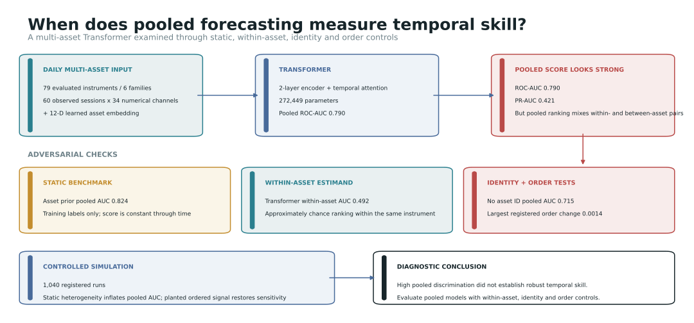
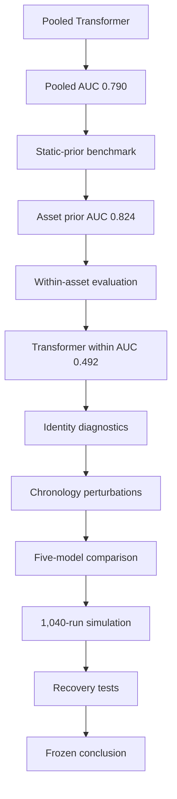
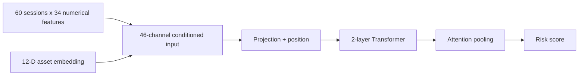
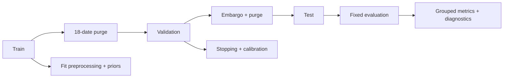
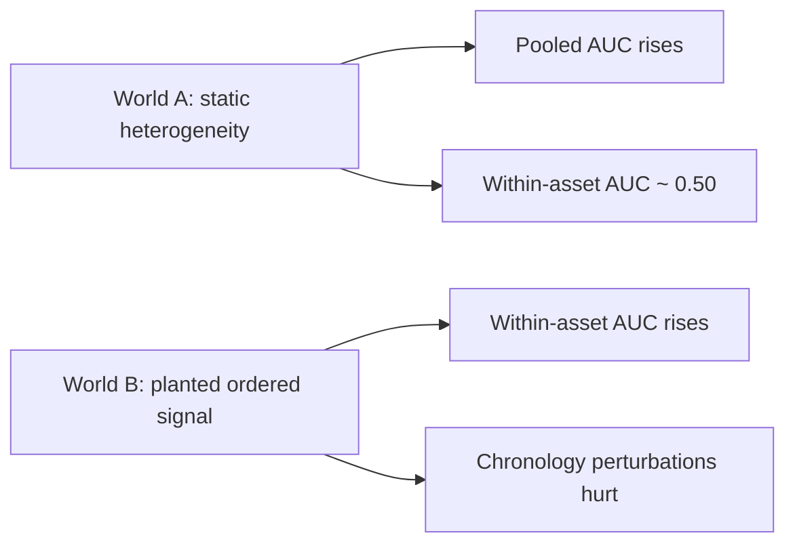
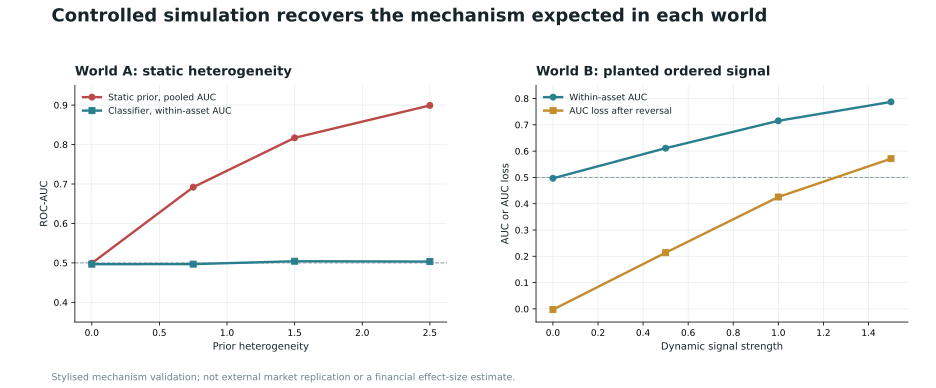

# Interpretable Transformer Models for Financial Time Series Forecasting

**Discovering Emergent Market Dynamics**

[](https://github.com/husaam-atq/MSc-financial-transformer-market-dynamics/actions/workflows/ci.yml)
[](https://www.python.org/)
[](https://pytorch.org/)
[](#project-status)

A multi-asset forecasting study testing whether strong pooled Transformer
performance reflects genuine temporal skill or persistent cross-sectional
structure.

Controlled simulation confirms that the project's diagnostic framework separates
static prevalence heterogeneity from deliberately planted ordered temporal signal.
This is a forecasting and model-evaluation study, not a trading system or a claim
of profitability.

> [!IMPORTANT]
> **Central finding:** the Transformer achieved pooled ROC-AUC **0.790**, but a
> training-only static asset prior achieved **0.824** and the Transformer's
> pair-weighted within-asset ROC-AUC was **0.492**. Strong pooled discrimination
> therefore did not establish robust temporal forecasting skill.



*The final daily study evaluates a pooled Transformer through static baselines,
within-asset estimands, identity interventions, temporal-order perturbations and a
registered controlled simulation.*

**Choose your path:** [Examiner: key findings and methodology](#key-finding) |
[Researcher: diagnostics and simulation](#diagnostic-framework) |
[Developer: reproducibility and setup](#reproducibility) |
[Dissertation: current artefacts](#dissertation-artefacts)

**Key links:** [Headline results](#key-finding) | [Methodology](#methodology) |
[Diagnostic framework](#diagnostic-framework) | [Controlled simulation](#controlled-simulation) |
[Reproducibility](#reproducibility) | [Repository structure](#repository-structure) |
[Broader experimental programme](#broader-experimental-programme) |
[Dissertation artefacts](#dissertation-artefacts) |
[Frozen release](https://github.com/husaam-atq/MSc-financial-transformer-market-dynamics/tree/dissertation-final)

## Contents

- [Research question](#research-question)
- [Key finding](#key-finding)
- [Research decision path](#research-decision-path)
- [Methodology](#methodology)
- [Leakage-aware evaluation](#leakage-aware-evaluation)
- [Diagnostic framework](#diagnostic-framework)
- [Controlled simulation](#controlled-simulation)
- [Reproducibility](#reproducibility)
- [Repository structure](#repository-structure)
- [Data access](#data-access)
- [Broader experimental programme](#broader-experimental-programme)
- [Scope and limitations](#scope-and-limitations)
- [Dissertation artefacts](#dissertation-artefacts)
- [Project status](#project-status)
- [Citation](#citation)
- [Licence](#licence)

---

## Research question

When a pooled model ranks adverse events across many financial instruments, does
its score capture changing risk through time, or mainly persistent differences in
event prevalence between assets?

A pooled ROC-AUC compares positive and negative observations both within and
between assets. A score that never changes within an asset can therefore rank many
cross-asset pairs correctly when assets have different event rates. This project
tests that shortcut directly rather than treating one pooled metric as sufficient
evidence of forecasting skill.

## Key finding

| Headline evidence | Value |
|---|---:|
| Transformer pooled ROC-AUC | 0.790 |
| Static asset prior pooled ROC-AUC | **0.824** |
| Transformer pair-weighted within-asset ROC-AUC | 0.492 |
| Learned models passing the full temporal-skill gate | **0 / 5** |
| Registered controlled-simulation runs | 1,040 |

**High pooled discrimination did not establish robust temporal forecasting
skill.** The training-only asset prior was constant through time yet exceeded every
learned pooled score. The Transformer ranked observations within the same asset at
approximately chance. Its PR-AUC was 0.421056 and macro within-asset AUC was
0.538743; the training-only family prior reached pooled ROC-AUC 0.816549.


The strongest learned within-asset result came from the MLP: pooled ROC-AUC
0.796478 and within-asset ROC-AUC 0.556967, with a dependence-aware interval of
[0.504831, 0.600824]. It still failed the complete registered temporal gate. Across
flattened logistic regression, MLP, LSTM, TCN and Transformer models, none passed
all five gate conditions.

### Identity and chronology diagnostics

- removing explicit asset identity reduced Transformer pooled ROC-AUC to 0.715477;
- cyclic asset-ID swapping reduced it to 0.682928 and changed probabilities by a
  mean absolute 0.090025;
- an asset probe decoded identity with accuracy 0.166930, versus chance near
  1/79 (0.0127);
- reversing, deterministically permuting and circularly shifting chronology left
  pooled ROC-AUC at 0.791263, 0.788585 and 0.790321 respectively.

The contribution is therefore methodological: a simulation-validated framework
for testing whether pooled financial models learn ordered temporal information or
cross-sectional shortcuts.

## Research decision path

Each stage tested a specific alternative explanation; repeated test-period
inspection across the wider programme made the historical evidence adaptive rather
than untouched confirmation.



---

## Methodology

The final experiment uses information available by an asset's close at forecast
origin `t`. Each model window contains 60 observed sessions. The adverse-event
label uses only the following ten observed sessions and is positive when a large
terminal loss, path drawdown or volatility escalation condition is met.

| Component | Frozen final design |
|---|---|
| Universe | 80 configured instruments; 79 form valid final model windows |
| Families | Equities, bonds, commodities, FX, crypto and real-asset proxies |
| Main-study observations | 306,174 daily OHLCV rows |
| Input window | 60 observed sessions |
| Forecast horizon | 10 observed sessions |
| Numerical inputs | 34 channels: 27 market features and 7 macro/context features |
| Asset conditioning | Separate 12-D learned embedding; 46 conditioned channels |
| Transformer | Two-layer pre-normalised encoder, four heads, temporal attention pooling |
| Trainable parameters | 272,449 |
| Final windows | 245,055 train; 20,494 validation; 21,514 test |
| Boundary controls | 18-date purge, one-date embargo, zero audited interval crossings |
| Selection | Train-only preprocessing; validation-only stopping, calibration and thresholding |



Adjusted close is preferred for returns and targets. Raw OHLC fields are retained
for gap, range and intraday-style features. Windows follow each asset's observed
calendar, so traditional-market weekends are not forward-filled into crypto. The
seven FRED context series are conservatively lagged before backward alignment, but
the panel is not a complete real-time-vintage reconstruction.

The final split contains the same **79-asset forecast-endpoint population** used by
the reported model evaluation. `UNI-USD` is excluded because its 24 eligible test
labels cannot form a 60-session test window. The corrected endpoint resource is
[`final_model_window_prevalence.csv`](src/market_dynamics/reporting/data/final_model_window_prevalence.csv).

Detailed definitions are retained in the
[`authoritative model specification`](reports/tables/ifddrp_transformer_authoritative_specification.md),
[`Phase 6 configuration`](configs/phase6_config.yaml) and
[`final evidence freeze`](reports/tables/ifddrp_final_evidence_freeze.md).

### Leakage-aware evaluation

| Split | Model windows | Permitted use |
|---|---:|---|
| Train | 245,055 | Fit preprocessing, priors and model parameters |
| Validation | 20,494 | Select stopping, calibration and thresholds |
| Test | 21,514 | Fixed evaluation and registered diagnostics |

The corrected fold uses an 18-date purge and one-date embargo. A direct interval
audit found zero target intervals crossing the final split boundaries.



The final test period was historically held out, but repeated inspection across
the wider research programme made it adaptive rather than untouched confirmation.

## Diagnostic framework

The evaluation asks what information supports a reported pooled score.

| Diagnostic | Question tested |
|---|---|
| Global, family and asset priors | Can static training-label prevalence explain pooled ranking? |
| Pair-weighted within-asset AUC | Can the model rank changing states within the same instrument? |
| Macro and equal-asset estimands | Does performance survive equal weighting across assets? |
| Asset-ID removal | How much does explicit identity conditioning contribute? |
| Cyclic asset-ID swap | Are predictions sensitive to assigning the wrong identity? |
| Representation probe | How strongly does the latent state encode asset identity? |
| Reversal, permutation and circular shift | Does pooled ranking require the registered temporal order? |
| Feature-group sensitivity | Which information groups affect scores? |
| Block, event and non-overlapping checks | How sensitive is inference to dependence and overlapping labels? |
| Controlled simulation | Do the diagnostics recover known static and dynamic mechanisms? |

Ranking metrics use raw ensemble scores. Calibration and thresholded metrics use
validation-selected probabilities; the two score types are not mixed.

## Controlled simulation

Two stylised worlds test the diagnostic mechanism under known data-generating
conditions:

- **World A:** asset-level event-rate heterogeneity with no planted ordered
  temporal signal. The static-prior pooled AUC increased by 0.400021 while
  within-asset AUC remained 0.500086.
- **World B:** no prior heterogeneity and deliberately planted ordered signal. At
  the strongest setting, within-asset AUC reached 0.783997; reversal and
  permutation reduced AUC by 0.380991 and 0.102297.





All **1,040** registered runs completed. The simulation validates expected
diagnostic behaviour under controlled mechanisms. It is not external market
replication, a causal result or an estimate of a real financial effect size. See
the [`simulation protocol`](reports/tables/prp1_study_a_independent_simulation_protocol.md)
and [`gate inference`](reports/tables/prp1_study_a_independent_simulation_gate_inference.csv).

---

## Reproducibility

### Quick start

The following PowerShell path reproduces the public validation environment on
Python 3.11 or later. The CPU PyTorch wheel is sufficient for tests and reporting.

```powershell
py -m venv .venv
.venv\Scripts\python.exe -m pip install --upgrade pip
.venv\Scripts\python.exe -m pip install --index-url https://download.pytorch.org/whl/cpu "torch>=2.9"
.venv\Scripts\python.exe -m pip install -e ".[dev]"
.venv\Scripts\python.exe -m pytest
.venv\Scripts\python.exe scripts/check_public_hygiene.py
```

Rebuild the tracked README and repository-preview assets from frozen compact
evidence tables:

```powershell
.venv\Scripts\python.exe scripts/build_readme_assets.py
```

The generator writes deterministic files under [`assets/readme/`](assets/readme/)
and does not load raw market data, predictions or model checkpoints.

<details>
<summary><strong>Paper/reporting smoke build</strong></summary>

Install the documentation extra and render the existing repository paper to an
ignored verification directory:

```powershell
.venv\Scripts\python.exe -m pip install -e ".[docs]"
.venv\Scripts\python.exe scripts/build_dissertation_paper.py --source reports/paper/draft_dissertation_paper_v4.md --output results/dissertation_build/verification/draft_dissertation_paper_v4.docx --artifacts results/dissertation_build/verification --edition v4
```

PDF conversion requires a local office-suite installation and is intentionally
separate from the Python build.

</details>

### Public and restricted artefacts

The public clone contains reconstruction code, configurations, compact source
manifests, tests and frozen summary evidence. It does **not** redistribute raw
provider data, private predictions or checkpoints.

Exact arithmetic reconstruction of selected final metrics requires locally
preserved ignored prediction files. Full model reconstruction additionally
requires the ignored processed daily panel and substantial compute. The normal
public audit path is therefore to inspect the compact metric registry, run tests,
rebuild presentation assets and, where appropriate, rerun the registered
simulation rather than retraining opened historical models.

> [!TIP]
> For this frozen study, prefer reconstruction from compact evidence and preserved
> prediction artefacts, where available, to unnecessary retraining on the
> already-opened historical period. Genuinely independent future replication
> remains appropriate.

Key audit sources:

- [`authoritative metric registry`](reports/tables/ifddrp_authoritative_metric_registry.csv)
- [`claim-evidence matrix`](reports/tables/ifddrp_claim_evidence_matrix.csv)
- [`cross-model results`](reports/tables/prp1_fixed_cross_model_results.csv)
- [`temporal-skill gates`](reports/tables/prp1_fixed_cross_model_temporal_skill_gates.csv)
- [`final scientific audit`](reports/tables/ifddrp_final_scientific_audit.md)

## Repository structure

```text
assets/readme/             Reproducible public presentation graphics
configs/                   Frozen study, model and universe specifications
data/manifests/            Compact provider quality and inclusion manifests
reports/paper/             Existing dissertation draft artefacts
reports/tables/            Frozen evidence, audits and compact result tables
scripts/                   Reproduction, validation and reporting entry points
src/market_dynamics/       Data, modelling, evaluation and reporting package
tests/                     Leakage, metric, model and reproducibility tests
.github/workflows/         Public CI validation
CITATION.cff               Repository citation metadata
```

## Data access

Yahoo Finance supplied daily OHLCV data and FRED supplied macro/context series.
Raw provider files are not redistributed. Reconstruction code and compact quality
manifests are public, but provider availability, terms, symbol histories and
revisions can change.

The exact configured symbols are recorded in the
[`daily universe`](configs/universes/daily_global_universe.csv) and
[`crypto-hourly universe`](configs/universes/crypto_hourly_universe.csv). Public
quality and inclusion records are available in
[`data/manifests/`](data/manifests/). The FRED panel is conservatively lagged but
uses current-vintage downloads rather than a complete point-in-time ALFRED
reconstruction.

> [!NOTE]
> Raw market/provider data, private predictions and model checkpoints are not
> redistributed. Public reconstruction therefore relies on acquisition code,
> manifests, configurations and compact frozen evidence, subject to provider
> availability and terms.

---

## Broader experimental programme

<details>
<summary><strong>Secondary crypto-hourly volatility track</strong></summary>

Alongside the final daily multi-asset classification study, an earlier exploratory
track examined hourly cryptocurrency volatility forecasting across 20 pairs. This
track used **1,213,437 hourly observations** and a heteroscedastic BiLSTM to
forecast four-hour log-realised volatility. It is retained as a technically
distinct secondary experiment rather than part of the final falsification
analysis.

| Secondary-track metric | Value |
|---|---:|
| Seed-mean RMSE | 0.6015 ± 0.0049 |
| Pearson correlation | 0.5616 |
| Spearman correlation | 0.5289 |

The hourly experiment used a different sampling frequency, target, model objective
and evaluation design. Its exploratory prediction intervals behaved sensibly, but
it did not undergo the complete falsification battery applied to the daily study.
The public repository includes its code, configuration, universe and compact data
manifests; exact numerical reproduction is incomplete without ignored raw and
derived artefacts.

Across these distinct daily and hourly experimental tracks, the broader project
processed **1,519,611 observations (approximately 1.52 million)**. This is not one
unified dataset or one model-training sample. The daily Transformer used the
separate 306,174-row daily panel.

> [!NOTE]
> The approximately 1.52 million observations are the sum of two distinct
> experimental tracks: 306,174 daily observations and 1,213,437 hourly crypto
> observations. They are not one unified dataset or one model-training sample.

</details>

## Scope and limitations

- The historical test period is adaptive rather than untouched confirmation.
- The current-symbol universe is not a complete survivorship-aware constituent
  history.
- The adverse-event label has different rarity and severity across asset families.
- Ten-session outcomes overlap; dependence-aware checks reduce but do not remove
  all inferential uncertainty.
- FRED features are conservatively lagged but not fully vintage reconstructed.
- Daily timestamps cannot resolve every asynchronous cross-market information
  clock.
- Removing explicit identity does not remove every indirect asset fingerprint.
- Simulation validates the diagnostic mechanism, not its prevalence in markets.
- No result establishes causality, profitability or production readiness.

---

## Dissertation artefacts

The repository retains the existing V4 dissertation artefacts; this presentation
pass does not replace or revise them:

- [Markdown source](reports/paper/draft_dissertation_paper_v4.md)
- [Editable DOCX](reports/paper/draft_dissertation_paper_v4.docx)
- [Eight-page PDF](reports/paper/draft_dissertation_paper_v4.pdf)

The original frozen research release remains at the
[`dissertation-final` tag](https://github.com/husaam-atq/MSc-financial-transformer-market-dynamics/tree/dissertation-final).

## Project status

The dissertation evidence is scientifically frozen. This repository contains the
reviewed implementation, tests, documentation and compact evidence supporting the
study. Future empirical work should use an independently registered replication or
prospective dataset rather than reopen the historical panel for target or
architecture search.

## Citation

Citation metadata are provided in [`CITATION.cff`](CITATION.cff).

> Muhammad Husaam Ateeq (2026). *Interpretable Transformer Models for Financial
> Time Series Forecasting: Discovering Emergent Market Dynamics*. MSc Data Science
> dissertation, Queen Mary University of London. Public research release:
> `dissertation-final`.

No DOI or publication status is claimed.

## Licence

No software or data licence has been selected. Public visibility does not itself
grant reuse rights; choosing a licence remains an explicit repository-owner
decision.
